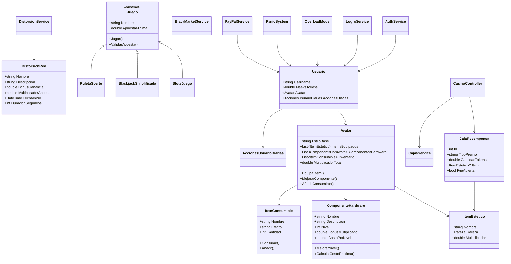

# Casino_POO 🎲🎰

## Descripción del proyecto

**Casino Maevs** es una aplicación web con estética cyberpunk que simula un casino interactivo con sistema de usuario, recargas, juegos, cajas de recompensa, inventario de ítems, mejoras de hardware, mercado negro de tokens, distorsiones de red, logros, modo sobrecarga y botón de pánico.

El proyecto está dividido en dos partes:

- **Backend_API**: desarrollado en **C# / .NET 8**, donde vive la lógica del negocio, los modelos, los servicios y los endpoints.
- **Frontend**: desarrollado con **HTML, CSS y JavaScript**, donde se muestran las pantallas de inicio, lobby, recompensas y avatar.

La idea principal es que el usuario pueda registrarse, iniciar sesión, recargar tokens, jugar, abrir recompensas, mejorar su perfil y ver cambios visuales según su progreso o según los eventos del sistema.

---

## Cómo funciona el proyecto

1. El usuario entra al **frontend** desde el navegador.
2. Se registra o inicia sesión en `index.html`.
3. Desde el **lobby** puede acceder a los juegos principales:
   - Slots
   - Blackjack
   - Ruleta
4. También puede interactuar con:
   - Cajas de recompensa
   - Inventario de ítems
   - Mejoras de hardware
   - Mercado negro de tokens
   - Distorsiones de red
   - Overload Mode
   - Botón de pánico
   - Logros
5. El frontend consume la API del backend mediante `fetch()`.
6. El backend responde con los cambios de saldo, premios, estados y resultados de cada acción.

---

## Diagrama de clases principal



---

## Qué partes usan POO y cuáles usan programación funcional

### Partes que usan Programación Orientada a Objetos (POO)

El proyecto usa POO principalmente en el **backend**, porque la lógica está organizada en clases con responsabilidades claras.

#### 1. Modelos
Clases como `Usuario`, `Avatar`, `CajaRecompensa`, `ComponenteHardware`, `ItemEstetico`, `ItemConsumible` y `DistorsionRed` representan entidades reales del sistema.

**Justificación:**  
Cada clase encapsula sus propios datos y comportamientos. Por ejemplo, `Usuario` controla su saldo, `Avatar` agrupa ítems y hardware, y `ComponenteHardware` maneja su nivel y costo de mejora.

#### 2. Herencia y polimorfismo
La clase abstracta `Juego` sirve como base para juegos como `SlotsJuego`, `BlackjackSimplificado` y `RuletaSuerte`.

**Justificación:**  
Esto permite reutilizar validaciones comunes, como la apuesta mínima, y al mismo tiempo que cada juego tenga su propia lógica dentro del método `Jugar()`.

#### 3. Encapsulación
Varias clases usan propiedades privadas o validaciones internas.

Ejemplos:
- `Usuario.MaevsTokens` no permite valores negativos.
- `CajaRecompensa.TipoPremio` solo acepta ciertos valores.
- `ComponenteHardware.Nivel` se modifica solo mediante métodos.

**Justificación:**  
Esto evita errores y mantiene los datos consistentes.

#### 4. Servicios como objetos con responsabilidad definida
Clases como `AuthService`, `BlackMarketService`, `DistorsionService`, `LogroService`, `OverloadMode`, `PanicSystem` y `PayPalService` representan módulos especializados del sistema.

**Justificación:**  
Cada servicio resuelve una tarea concreta y ayuda a separar la lógica en partes más fáciles de mantener.

---

### Partes que usan programación funcional

Aunque el proyecto es principalmente orientado a objetos, también usa ideas funcionales en varias partes.

#### 1. Uso de LINQ
Ejemplos claros están en:
- `LogroService` (`Where`, `Count`, `FirstOrDefault`)
- `Avatar` (`Any`, `Sum`, `FirstOrDefault`)
- `CasinoController` al filtrar cajas

**Justificación:**  
LINQ permite trabajar con colecciones usando filtros, proyecciones y conteos de forma más declarativa y corta.

#### 2. Funciones de cálculo puro
Ejemplos:
- `BlackMarketService.ComprarTokens()`
- `BlackMarketService.VenderTokens()`
- `DistorsionService.AplicarDistorsion()`
- `DistorsionService.AplicarCostoDistorsion()`
- `ComponenteHardware.CalcularCostoProxima()`

**Justificación:**  
Estas funciones reciben datos y devuelven resultados sin depender demasiado del estado visual, lo cual es una idea cercana al estilo funcional.

#### 3. Callbacks y temporizadores
Servicios como `BlackMarketService` y `DistorsionService` usan `Timer` para ejecutar acciones automáticamente cada cierto tiempo.

**Justificación:**  
Esto responde a un modelo más reactivo y basado en funciones de ejecución programadas.

#### 4. Frontend con eventos
En el frontend, los botones y formularios funcionan mediante eventos de JavaScript y llamadas `fetch()`.

**Justificación:**  
Aquí no se trabaja tanto con clases, sino con acciones que reaccionan a eventos del usuario.

---

## Instrucciones de ejecución

### 1. Abrir el proyecto en Visual Studio Code
Descargar .zip del proyecto y abre la carpeta raíz en Visual Studio Code.

### 2. Terminal 1: iniciar el backend
Abre una terminal (control + j) y ejecuta:

```bash
cd Backend_API
dotnet restore
dotnet run
```

El backend quedará ejecutándose en:

```bash
http://localhost:5000
```

### 3. Terminal 2: iniciar el frontend
Abre otra terminal distinta y ejecuta:

```bash
cd Frontend
python -m http.server 8000
```

Luego abre el navegador en:

```bash
http://localhost:8000
```

### 4. Orden recomendado
Primero inicia el **backend** y después el **frontend**, para que las peticiones `fetch()` encuentren la API disponible.

---

## Reflexión final

### Qué fue fácil
Lo más fácil fue organizar el proyecto en módulos separados, porque cada parte tiene una función clara: usuarios, juegos, recompensas, mercado, logros y distorsiones. También fue sencillo conectar el frontend con la API usando `fetch()`.

### Qué fue difícil
Lo más difícil fue coordinar varias mecánicas al mismo tiempo sin que el proyecto se volviera desordenado. Por ejemplo, manejar el saldo del usuario, los premios, los multiplicadores, el inventario y las distorsiones exige que la lógica esté bien validada.

### Qué aprendimos
Aprendimos a combinar **POO** con herramientas funcionales como LINQ y temporizadores, y también a separar correctamente la lógica del sistema entre frontend y backend. Además, entendimos que un proyecto bien estructurado no solo debe funcionar, sino también ser fácil de mantener, extender y explicar.

---

## Estructura general del proyecto

```text
CasinoMaevs-main/
├─ Backend_API/
│  ├─ Controllers/
│  ├─ Models/
│  ├─ Services/
│  ├─ Program.cs
│  └─ appsettings.json
├─ Frontend/
│  ├─ assets/
│  │  └─ css/
│  ├─ index.html
│  ├─ lobby.html
│  ├─ rewards.html
│  └─ avatar.html
└─ README.md
```

---

## Nota final

Este proyecto está pensado como una simulación educativa de casino interactivo con estética cyberpunk, buena separación de capas y ejemplos claros de programación orientada a objetos, validaciones, colecciones, herencia, polimorfismo y uso de LINQ.
